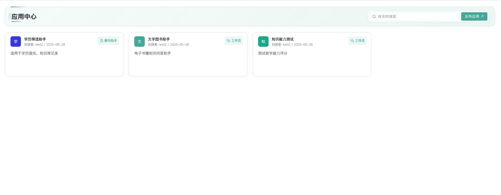
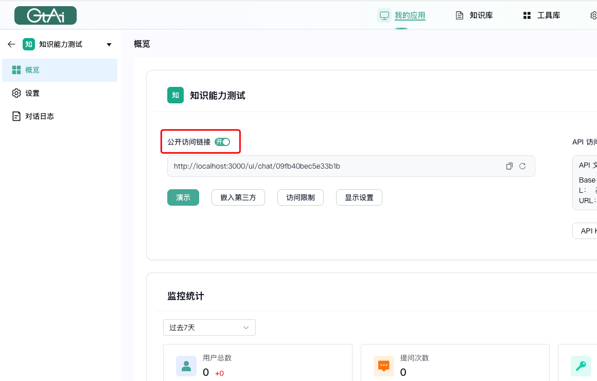

<!-- !!! Abstract ""

    - [GTAI](https://github.com/1Panel-dev/GTAI/issues)  -->

<!-- ## 2 社区论坛 -->

!!! Abstract ""
    GTAI 在数字化发展的浪潮中，为满足用户多元需求，我们团队精心打造的全新应用中心正式上线。这一创新平台旨在为用户带来更高效、更便捷的体验。现诚邀各位用户将精心编辑的工作流与实用聊天助手一键发布至应用中心。通过这一平台，您的创意与智慧将得以充分展现，同时为更多用户带来便利与价值。工作流的发布，能够让复杂繁琐的任务得以高效梳理与执行；聊天助手的共享，则为日常交流与信息获取提供了智能支持。我们期待您的参与，让无数创意与实用成果在应用中心汇聚，共同开启智慧应用的全新篇章。
   

!!! Abstract ""
    参与方式如下，所有开放链接的应用都会在应用中心展示。
